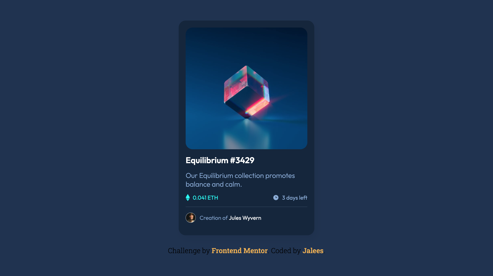

# Frontend Mentor - NFT preview card component solution

This is a solution to the [NFT preview card component challenge on Frontend Mentor](https://www.frontendmentor.io/challenges/nft-preview-card-component-SbdUL_w0U). Frontend Mentor challenges help you improve your coding skills by building realistic projects. 

## Table of contents

- [Overview](#overview)
  - [Screenshot](#screenshot)
  - [Links](#links)
- [My process](#my-process)
  - [Built with](#built-with)
- [Author](#author)
- [Acknowledgments](#acknowledgments)

## Overview

A simple front-end challenge from Frontend Mentor

### Screenshot

### Links

- Solution URL: [https://github.com/jaleesadasilva/QR-code-component](https://your-solution-url.com)
- Live Site URL: [https://jaleesadasilva.github.io/QR-code-component](https://your-live-site-url.com)

## My process

### Built with

- Semantic HTML5 markup
- SASS
- Flexbox
- css transition

## Author

- Website - [Jaleesa](https://nunesdasilva.nl)
- Frontend Mentor - [@Jaleesadasilva](https://www.frontendmentor.io/profile/Jaleesadasilva)